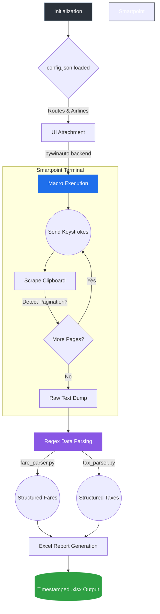

# Process Optimization Using pywinauto

A Python-based automation solution for controlling the Travelport Smartpoint terminal, extracting complex Global Distribution System (GDS) data, and structuring the output into clean Excel reports.

[](https://github.com/IhsanKabir/Process_Optimization_Using_pywinauto/actions/workflows/test.yml)
[](https://www.python.org/downloads/)

## Overview

The main motivation behind this project was to eliminate the heavy manual burden of constantly querying GDS systems by hand. Scraping an archaic terminal application requires robust UI automation and complex regex parsing, especially since the data spans across multiple paginated screens built on 1960s-era terminal protocols.

### Key Features

- **Automated GDS Data Extraction**: Extracts fare and tax data from Travelport Smartpoint terminal
- **Intelligent Pagination**: Handles complex multi-page terminal output automatically
- **Secure Credential Management**: Environment variable-based authentication (no passwords in command line)
- **Excel Report Generation**: Creates formatted Excel reports with change tracking
- **Comprehensive Testing**: 25+ unit tests with CI/CD integration
- **Input Validation**: Validates all inputs to prevent injection attacks
- **Configuration Management**: Environment-specific configs with JSON schema validation 

## End-to-End Pipeline

The process follows a sequential pipeline to interact with the live desktop application:



1. **Initialization & Configuration**: The orchestrator (`main.py`) reads `config.json` to load the target routes, airlines, output file names, and UI timeout settings.
2. **UI Attachment**: The script utilizes `pywinauto` via the UIAutomation (UIA) backend to locate the active Smartpoint window on the desktop and attach to its command-line input box.
3. **Macro Execution**: `pyautogui` mimics human keystrokes to fire off the required GDS terminal commands (e.g., `FD` for fares, `FTAX` for taxes).
4. **Clipboard Scraping & Pagination**: The script reads the terminal output, detects Smartpoint-specific pagination prompts (like "More Fares" or missing "END" indicators), handles inline sub-commands like `FU*`, and accumulates the raw text strings.
5. **Regex Data Structuring**: The raw strings are passed to dedicated parsers (`fare_parser.py` / `tax_parser.py`) which use heavy regular expressions to isolate variables like fare basis codes, validities, maximum stays, and exact tax amounts by airport terminal.
6. **Excel Generation**: Finally, `openpyxl` takes the structured dictionaries and dynamically lays out the final `.xlsx` report files, applying color-coding and time-stamped metadata.

## Project Structure

```text
Process_Optimization_Using_pywinauto/
├── main.py                      # Primary orchestrator and CLI entry point
├── config.json                  # Configuration (not in git - create from example)
├── config_schema.json           # JSON schema for config validation
├── config_manager.py            # Configuration management with env support
├── constants.py                 # Centralized constants and magic numbers
├── smartpoint_automation.py     # UI automation logic (pywinauto/pyautogui)
├── parser.py                    # Fare display parsing (regex-based)
├── tax_parser.py                # Tax detail parsing (FTAX commands)
├── tax_breakdown_parser.py      # FS tax breakdown parsing
├── excel_report.py              # Excel report generation
├── tax_report.py                # Tax-specific Excel reports
├── change_detector.py           # Fare change detection and tracking
├── exceptions.py                # Custom exception hierarchy
├── validators.py                # Input validation functions
├── credential_manager.py        # Secure credential management
├── requirements.txt             # Production dependencies
├── requirements-dev.txt         # Development dependencies
├── pytest.ini                   # Pytest configuration
├── README.md                    # This file
├── CONFIG.md                    # Configuration guide
├── TROUBLESHOOTING.md           # Troubleshooting guide
├── .github/workflows/test.yml   # CI/CD pipeline
├── tests/                       # Test suite
│   ├── test_parser.py          # Parser tests
│   ├── test_validators.py      # Validator tests
│   ├── test_change_detector.py # Change detection tests
│   └── fixtures/               # Test data and fixtures
├── data/                        # Data directory (in .gitignore)
│   ├── raw/                    # Raw terminal output (debugging)
│   ├── logs/                   # Execution logs
│   ├── archive/                # Historical snapshots (change tracking)
│   └── reports/                # Generated Excel reports
└── build/                       # Build artifacts (in .gitignore)
```

## Core Capabilities

### Fare Extraction
The script automatically drives the terminal to pull comprehensive public, private, and unsaleable fare datasets across requested airline and route combinations. It handles complex pagination logic (e.g., sending `MD` continuously, intercepting currency loops, breaking out of stuck screens, and knowing when to fall back on the `FU*` command). The final Excel output contains the Fare Basis, Currency, Amount, Seasons, Min/Max stays, and ticketing details.

### Tax Scraping
The terminal tax definitions (`FTAX-{CC}/{CODE}`) are incredibly dense. A major challenge in the project was figuring out how to intelligently paginate through 20+ pages of irrelevant tax exemption legal text just to locate the specific `TAX RATE:` blocks. The project parses out these specific amounts against distinct time-ranges and airport categorization rules.

### Ongoing Development
I am actively adding new features to the pipeline, including:
- Extracting Queue Charges (YQ/YR) mapped directly to specific fares.
- Pulling dynamic baggage allowance data directly from the terminal.
- Implementing an automated currency conversion pipeline within the Excel reporting layer.

## Setup Requirements

The execution environment requires:
- **Windows OS** with active Travelport Smartpoint session
- **Python 3.10+**
- An authenticated GDS session with active focus on the primary terminal window

### Installation

1. Clone the repository:
```bash
git clone https://github.com/IhsanKabir/Process_Optimization_Using_pywinauto.git
cd Process_Optimization_Using_pywinauto
```

2. Install dependencies:
```bash
pip install -r requirements.txt
```

3. Set up configuration:
```bash
# Copy example config
cp config.dev.json.example config.json

# Edit config.json with your settings
```

4. (Optional) Set up credentials via environment variables:
```powershell
# Windows PowerShell
$env:SMARTPOINT_USERNAME="your_username"
$env:SMARTPOINT_PASSWORD="your_password"
$env:SMARTPOINT_PCC="your_pcc"  # Optional
```

Or create a `.env` file:
```bash
pip install python-dotenv
```

```env
# .env file
SMARTPOINT_USERNAME=your_username
SMARTPOINT_PASSWORD=your_password
SMARTPOINT_PCC=your_pcc
```

### Development Setup

For development and testing:
```powershell
python -m venv .venv
.\.venv\Scripts\python.exe -m pip install --upgrade pip
.\.venv\Scripts\python.exe -m pip install -r requirements-dev.txt
```

## Running the Tool

### Basic Usage

**Fare extraction** (automatic mode):
```bash
python main.py --auto
```

**Tax extraction**:
```bash
python main.py --tax --auto
```

**Testing with limited routes**:
```bash
python main.py --auto --limit 5
```

**Filter by specific route**:
```bash
python main.py --auto --route DAC-MLE
```

**Filter by airline**:
```bash
python main.py --auto --airline BG,BS
```

### Advanced Options

```bash
# Skip change detection
python main.py --auto --no-changes

# Custom output file
python main.py --auto --output custom_report.xlsx

# Extract only currency data (skip fares)
python main.py --auto --only-currency

# Manual mode (process existing raw files)
python main.py
```

See `python main.py --help` for all options.

## Configuration

Configuration is managed through `config.json` (see [`CONFIG.md`](CONFIG.md) for details):

- **Environment-specific configs**: Use `APP_ENV` variable to load `config.dev.json`, `config.prod.json`, etc.
- **JSON Schema validation**: Automatic validation against `config_schema.json`
- **Secure credentials**: Never store passwords in config files - use environment variables

Example config structure:
```json
{
  "commands_file": "commands.txt",
  "airline_names": {"BG": "Biman Bangladesh"},
  "city_names": {"DAC": "Dhaka"},
  "rbd_sort_order": ["F", "A", "J", "C", "Y"],
  "domestic_airports": ["DAC", "CGP"],
  "tax_airports": {
    "SIN": {"country": "SG", "name": "Singapore"}
  }
}
```

## Testing

Run the test suite:
```powershell
# Run all tests
.\run_tests.ps1

# Run with coverage
.\run_tests.ps1 --cov=. --cov-report=html

# Run specific test file
.\run_tests.ps1 tests/test_parser.py -v

# Direct invocation if you prefer not to use the wrapper
.\.venv\Scripts\python.exe -m pytest

# Run linting
flake8 .
black --check .
mypy *.py
bandit -r .
```

## Troubleshooting

Common issues and solutions are documented in [`TROUBLESHOOTING.md`](TROUBLESHOOTING.md):

- Connection issues
- Clicking/UI interaction problems
- Data extraction failures
- Configuration errors
- Performance issues

## Security Notes

- **Never commit credentials** to version control
- Use environment variables for sensitive data
- The `.env` file is in `.gitignore` for your protection
- CLI password arguments have been removed for security
- All inputs are validated and sanitized

## Project Architecture
