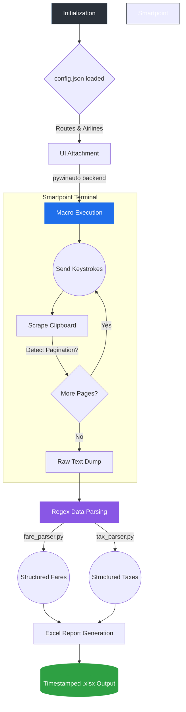

# Process Optimization Using pywinauto

A Python-based automation solution I built to control the Travelport Smartpoint terminal, extract complex Global Distribution System (GDS) data, and structure the output into clean Excel reports.

The main motivation behind this project was to eliminate the heavy manual burden of constantly querying GDS systems by hand. Scraping an archaic terminal application requires robust UI automation and complex regex parsing, especially since the data spans across multiple paginated screens built on 1960s-era terminal protocols. 

## End-to-End Pipeline

The process follows a sequential pipeline to interact with the live desktop application:



1. **Initialization & Configuration**: The orchestrator (`main.py`) reads `config.json` to load the target routes, airlines, output file names, and UI timeout settings.
2. **UI Attachment**: The script utilizes `pywinauto` via the UIAutomation (UIA) backend to locate the active Smartpoint window on the desktop and attach to its command-line input box.
3. **Macro Execution**: `pyautogui` mimics human keystrokes to fire off the required GDS terminal commands (e.g., `FD` for fares, `FTAX` for taxes).
4. **Clipboard Scraping & Pagination**: The script reads the terminal output, detects Smartpoint-specific pagination prompts (like "More Fares" or missing "END" indicators), handles inline sub-commands like `FU*`, and accumulates the raw text strings.
5. **Regex Data Structuring**: The raw strings are passed to dedicated parsers (`fare_parser.py` / `tax_parser.py`) which use heavy regular expressions to isolate variables like fare basis codes, validities, maximum stays, and exact tax amounts by airport terminal.
6. **Excel Generation**: Finally, `openpyxl` takes the structured dictionaries and dynamically lays out the final `.xlsx` report files, applying color-coding and time-stamped metadata.

## Project Structure

```text
travelport-automation/
├── main.py                     # Primary orchestrator and CLI entry point
├── config.json                 # Target routes, airlines, airports, and settings
├── smartpoint_automation.py    # pywinauto/pyautogui logic for terminal interaction
├── fare_parser.py              # Regex logic for extracting standard public/private fares
├── tax_parser.py               # Complex multi-page syntax parsing for tax exemptions
├── report_generator.py         # Formats scraped fare datasets into Excel worksheets
├── tax_report.py               # Formats categorized airport taxes into Excel
├── README.md                   # Project documentation
├── requirements.txt            # Python dependencies (pywinauto, pyautogui, openpyxl)
├── data/
│   ├── raw/                    # Automatically saved terminal strings (for debugging)
│   ├── logs/                   # System execution logs
│   ├── archive/                # Historical snapshot storage for delta comparisons
│   └── reports/                # Generated timestamped .xlsx output files
```

## Core Capabilities

### Fare Extraction
The script automatically drives the terminal to pull comprehensive public, private, and unsaleable fare datasets across requested airline and route combinations. It handles complex pagination logic (e.g., sending `MD` continuously, intercepting currency loops, breaking out of stuck screens, and knowing when to fall back on the `FU*` command). The final Excel output contains the Fare Basis, Currency, Amount, Seasons, Min/Max stays, and ticketing details.

### Tax Scraping
The terminal tax definitions (`FTAX-{CC}/{CODE}`) are incredibly dense. A major challenge in the project was figuring out how to intelligently paginate through 20+ pages of irrelevant tax exemption legal text just to locate the specific `TAX RATE:` blocks. The project parses out these specific amounts against distinct time-ranges and airport categorization rules.

### Ongoing Development
I am actively adding new features to the pipeline, including:
- Extracting Queue Charges (YQ/YR) mapped directly to specific fares.
- Pulling dynamic baggage allowance data directly from the terminal.
- Implementing an automated currency conversion pipeline within the Excel reporting layer.

## Setup Requirements

The execution environment requires:
- A Windows machine actively logged into Travelport Smartpoint.
- An authenticated GDS session with active focus on the primary terminal window.
- Python 3.10+ installed.

Dependencies can be installed via:
```bash
pip install -r requirements.txt
```

## Running the Tool

To run the standard Fare extraction pipeline:
```bash
python main.py --auto
```

To run the Tax extraction pipeline:
```bash
python main.py --tax --auto
```

For quick testing on a single route or airport without waiting for the full batch:
```bash
python main.py --tax --auto --limit 1
```
